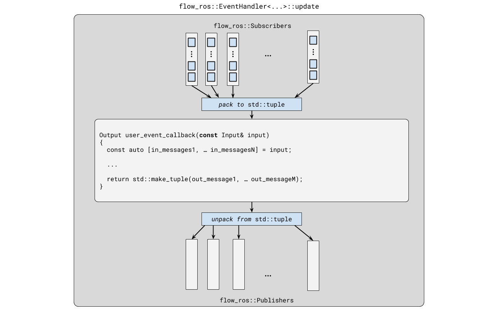

# Flow-ROS

C++14 library providing ROS-enabled wrappers for [Flow](https://github.com/fetchrobotics/flow).


## API Documentation

Coming soon.


## What is this used for?

This library is meant for synchronizing multiple series of ROS messages, collected by `ros::Subscribers`. This is typically desirable in ROS nodes in which multiple inputs are required to compute something where the result is only correct if the inputs have similar time-stamp values. Since messages may be produced at different rates and from different sources, it is usually important that there are some gaurantees about the time difference between associated message stamps. This library uses [Flow](https://github.com/fetchrobotics/flow) to enable message syncrhonization.

Secondarily, this library provides in-process subscriber/publisher mechanisms which do not require a running ROS core and are swappable with their ROS-enabled counterparts. These are especially useful for testing message passing subsystems.


## Requirements

- [ROS](http://wiki.ros.org/melodic/Installation)
    + Tested with ROS Melodic
- [rosbag](http://wiki.ros.org/rosbag)
- [Boost](https://www.boost.org/users/history/version_1_65_1.html) (v1.65.1)
- [Bazel](https://docs.bazel.build/versions/3.4.0/getting-started.html)
    + repository currently provides Bazel build configurations for the library and tests
    + `cmake` configurations _coming soon_; contribution welcome
    + This library can be used as a header-only library if you will not be making use of the ROS-free local message passing facilities provided by `flow_ros::Router`.


## Components

### Subscribers

[`ros::Subscriber`](http://wiki.ros.org/ROS/Tutorials/WritingPublisherSubscriber%28c%2B%2B%29) objects are commonly used to listen for messages and run callbacks on message-receive events. These callbacks are run with de-serialized message contents as an input. Since this callback works on a single series of messages, a synchronization mechanism is needed to match these messages to messages recieved by other subscribers. This is where `flow_ros::Subscribers` come in.

`flow_ros::Subscriber` wrap `ros::Subscriber` objects and use their message-callback behavior to "inject" messages into a buffer. The contents of this buffer are serviced to synchronize messages across multiple series.


The way that messages are collected from a `flow_ros::Subscriber` buffer is defined by an associated synchronization policy, which may be configured with a Flow [driver](https://github.com/fetchrobotics/flow#drivers) or [follower](https://github.com/fetchrobotics/flow#followers) template as a template argument.

A `flow_ros::Subscriber` type may look as follows:

```c++
using PoseStampedSubscriberType = flow_ros::Subscriber<geometry_msgs::PoseStamped,  // message type
                                                       flow::follower::Before       // sync policy
                                                      >;

ros::NodeHandle nh;

PoseStampedSubscriberType sub{nh, "topic", 1 /*ROS queue size*/, ros::Duration{1} /*policy-specific args*/};
```

#### Synchronization


`flow_ros::Subscribers` can be serviced just like `flow::Captor` objects to synchronize messages, like so:

```c++
// We have three subscribers to synchronize; odometry and pose data are
// synchronized to laser scan messages

using LaserScanSubscriberType =
  flow_ros::Subscriber<sensor_msgs::LaserScan, flow::driver::Next>;

using PoseStampedSubscriberType =
  flow_ros::Subscriber<geometry_msgs::PoseStamped, flow::follower::Before>;

using OdometrySubscriberType =
  flow_ros::Subscriber<nav_msgs::Odometry, flow::follower::ClosestBefore>;

...

std::vector<sensor_msgs::LaserScan::ConstPtr> scans;
std::vector<geometry_msgs::PoseStamped::ConstPtr> poses;
std::vector<nav_msgs::Odometry::ConstPtr> odoms;

// Run data capture
const auto result = flow::Synchronizer::capture(
  std::forward_as_tuple(scan_driver, pose_follower, odom_follower),
  std::forward_as_tuple(std::back_inserter(scans),
                        std::back_inserter(poses),
                        std::back_inserter(odoms)));

if (result == flow::State::PRIMED)
{
  // scans, poses, odoms are ready
}
```

By default, `flow_ros::Subscribers` are configured such that `flow::Synchronizer::capture` needs to be called in a separate thread, as subscriber synchronization policies have built-in data waits which wake on data injection. For single threaded contexts, and extra template argument should be provided.

For a completely single-threaded application, you can do away with the overhead thread-safety mechanisms with `flow::NoLock` as follows:

```c++
using PoseStampedSubscriberType = flow_ros::Subscriber<geometry_msgs::PoseStamped,  // message type
                                                       flow::follower::Before,      // sync policy
                                                       flow::NoLock                 // no data waits
                                                      >;
```

For multi-threaded applications which employ synchronization polling rather than data waits, the `flow::PollingLock` template can be used make buffer accesses from multiple threads safe:

```c++
using LockType = std::lock_guard<std::mutex>;

using PoseStampedSubscriberType = flow_ros::Subscriber<geometry_msgs::PoseStamped,  // message type
                                                       flow::follower::Before,      // sync policy
                                                       flow::PollingLock<LockType>  // locking, but no waits
                                                      >;
```

#### Message sequencing


Default data sequencing within `flow_ros::Subscriber` buffers is performed using message header stamps. Namely, messages are ordered using `ros::Time`. Time offsets are specified with `ros::Duration`.

The Flow library describes how to implement [custom](https://github.com/fetchrobotics/flow#dispatch) data traits objects for dealing with data sequencing. Following this scheme, a default set of traits and accessors are provided in [`message_stamp_access.h`](flow_ros/include/message_stamp_access.h) which assume that messages have `MsgType::header::stamp`. Messages which do not have a `header`, but do have a `ros::Time` member are usable (in addition to those which work by default) after defining the appropriate companion accessors. For example, one can implement specialized access for a particular message like so:

```c++
namespace flow
{

template <> struct DispatchAccess<boost::shared_ptr<const CustomMessageType>>
{
  using CustomMessageConstPtr = boost::shared_ptr<const CustomMessageType>;

  static const ros::Time& stamp(const CustomMessageConstPtr& msg) { return msg->ros_time_stamp; }

  static const CustomMessageConstPtr& value(const CustomMessageConstPtr& msg) { return msg; }
};

}  // namespace flow
```

When using `flow_ros::Subscriber` objects directly, you may also opt to use sequence numbers for data ordering. Default handling for this is provided by [`message_seq_access.h`](flow_ros/include/message_seq_access.h).


#### Transport abstraction


Aside from providing a synchronization mechanisms on top of `ros::Subscribers`, `flow_ros::Subscribers` also provide a level of transport abstraction. Moreover, `flow_ros::Subscribers` may also be used in contexts without a running ROS core through the use of `flow_ros::Router`.

The `flow_ros::Router` provides simple in-process message passing facilities. It implements a subset of the methods provided by `ros::NodeHandle` which can be used to initialize both `flow_ros::Subscriber` and `flow_ros::Publisher` objects. This is convenient for areas of a program that don't need to expose external message connections (like unit tests). It also enables the passing of "non-message" objects to be synchronized with ROS messages, so long as they also use the same sequencing stamp type, i.e. `ros::Time`, sequence number, etc.


#### Messages from ROS bag files


`flow_ros::Router` supports message data injection from a `rosbag::MessageInstance`. This means that you can pump messages through a system of `flow_ros::Publisher` and `flow_ros::Subscriber` objects setup to pass messages locally. This is especially useful for testing a subsystem which using data collected from a live run.

```c++
using LaserScanSubscriberType =
  flow_ros::Subscriber<sensor_msgs::LaserScan, flow::driver::Next>;

// Create local message router
flow_ros::Router router;

// Create lase scan subscriber
LaserScanSubscriberType laser_scan_sub{router, "/base_scan", 10U};

// Open a bag in read mode
rosbag::Bag bag;
bag.open("test.bag", rosbag::bagmode::Read);

std::vector<std::string> topics;
topics.emplace_back("/base_scan);

// Inject messages
rosbag::View view{bag, rosbag::TopicQuery{topics}};
for (const auto& mi : view)
{
  router.inject(mi);
}

// Now there are messages loaded in laser_scan_sub
// laser_scan_sub.size() == 10
```

### Publishers


`flow_ros::Publishers` are meant to be simple wrappers around `ros::Publisher` functionality, and are used in the same way as `ros::Publisher` objects. All that they add is the ability to make use of local message passing for interoperability with `flow_ros::Subscriber` objects. They also ensure a stable interface for use with the `flow_ros::EventHandler`.

A `flow_ros::MultiPublisher` template is provided for the purpose of outputting a sequence of messages returned from a `flow_ros::EventHandler` event callback.


### Event Handler


The `flow_ros::EventHandler` is a higher level mechanism for message driven callback execution. The `EventHandler` is used to:

1. service several subscription resources to gather synchronized data
2. run an event callback with captured data as an input, if synchronization was possible
3. publish values returned by the event callback (may also return/publish nothing)


Note that the `flow_ros::Subscriber` and `flow_ros::Publisher` objects used with the `EventHandler` may mix local message passing through a `flow_ros::Router` and ROS message communication freely.





A `flow_ros::EventHandler` can be used in a single threaded application like so:

```c++
// A tuple of publisher types
using Publishers = std::tuple<
  flow_ros::Publisher<const geometry_msgs::PoseStamped>,
  ...
  flow_ros::Publisher<const CustomResultType>
>;

// A tuple of subscriber types (note the use of flow::NoLock)
using Subscribers = std::tuple<
  flow_ros::Subscriber<sensor_msgs::LaserScan, flow::driver::, flow::NoLock>,
  flow_ros::Subscriber<geometry_msgs::PoseStamped, flow::follower::Before, flow::NoLock>,
  ...
  flow_ros::Subscriber<nav_msgs::Odometry, flow::follower::ClosestBefore, flow::NoLock>
>;

// Event handler type
using EventHandlerType = flow_ros::EventHandler<Publishers, Subscribers>;

ros::NodeHandle nh;

// Instance handler with publisher and subscriber resources
EventHandlerType event_handler{
  std::forward_as_tuple(
    std::make_shared<flow_ros::Publisher<geometry_msgs::PoseStamped>>(nh, "out_topic1", 1),
    ...
    std::make_shared<flow_ros::Publisher<CustomResultType>>(nh, "out_topicM", 1)
  ),
  std::forward_as_tuple(
    std::make_shared<flow_ros::Subscriber<sensor_msgs::LaserScan, flow::driver::Next>>(nh, "in_topic1", 1),
    std::make_shared<flow_ros::Subscriber<geometry_msgs::PoseStamped, flow::follower::Before>>(nh, "in_topic2", 1, ...),
    ...
    std::make_shared<flow_ros::Subscriber<nav_msgs::Odometry, flow::follower::ClosestBefore>>(nh, "in_topicN", 1, ...)
  )
};

// Start fresh; clear all subscriber buffers
event_handler.reset();

while (ros::ok())
{
  // Synchronize and execute next event
  const flow_ros::EventSummary summary = event_handler.update();

  if (summary.state == flow_ros::EventSummary::State::EXECUTED)
  {
    ROS_DEBUG("event callback executed");
  }

  // (Optionally) check if next event is possible without waiting or executing callback...
  const flow_ros::EventSummary dry_summary = event_handler.dry_update();

  ros::spinOnce();
}
```


## Running Tests

```
bazel test ... --test_output=all
```

Bazel isn't everyone's cup of tea. _cmake build to come later_; earlier contribution welcome.
